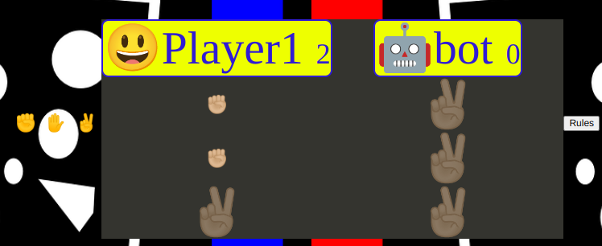

#QuickGamer
quickgamer is a page intended to have a few mini games were you will be able to navigate through the games list there you will have games such as Rock,Paper,Scissors,snap and chess. each page has a navigation bar which will alow you to go to the game of choice play area. the page is useful for people wanting to enjoy a quick gameplay in their spare time. it alows you to play and also gives toutorials for beginners to learn how to play. this is a site that hopes to demonstrate how JavaScript works behind content to allow enjoyment and interaction for the user.

## Features 
the main fetures introduced in Quick gamer are as follows 
1. the nav list- this fetuere alows you to navigate through the site giving you a choice of game
2. Rock Paper Scissors -  the main feture of the site as it has already been coded with java script to produce  a working game.
3. chess - is another future feture to be coded and added to the site.
4. snap - this is another one of are game playing options  but also a future feture right now with just the tutorial video  as the main part of that page.
5. the logo  written in yellow at the top of the page Quick gamer.
6. the About us page which gives information about quick gammer its founders and what it hopes to do in the future 
7. the footer which has the ways of getting in contact with us through social media sites but also has email and telephone number

### Existing Features

- __ Logo and Heading__

  - Featured at the top of the page, the Quick Gamer logo and heading is easy to see for the user. Upon viewing the page, the user will be able to see the name of the site and game  list.

- __The Game Area__
- at the moment we currently have one working gsame area for the rock paper scissors game 
  - in this game you have the three icons which are  rock, paper,scissors
  - you will have the labels for the player and the players icon and you will have the same for the bot which is the computer.
  - the tally of results wins and loses will be  in this area 
  - you will also be able to select the rules button to see how the game is played 

- __rock-paper-scissors__
- the page upon click presents you with  a modul log that asks "player1 what is your name ?" depending on user input the result will now sit beside the player1 label in the game area, if the user does not input a name and hits "cancel" or "ok" the player1 label alone will represent the username.
-once on the page you have:
1. nav list in the top left corner of the page.
2. the logo "QuickGamer" at the top center of the page.
3. the game area seated in the center contained in a black div.
4. the footer at the bottom of the page containig social media contact information 

- __The Score Area__

  - This section will allow the user to see exactly how many correct and incorrect answers they have provided. 

For some/all of your features, you may choose to reference the specific project files that implement them.

In addition, you may also use this section to discuss plans for additional features to be implemented in the future:

### Features Left to Implement

- Another feature idea

## Testing 

In this section, you need to convince the assessor that you have conducted enough testing to legitimately believe that the site works well. Essentially, in this part you will want to go over all of your project’s features and ensure that they all work as intended, with the project providing an easy and straightforward way for the users to achieve their goals.

In addition, you should mention in this section how your project looks and works on different browsers and screen sizes.

You should also mention in this section any interesting bugs or problems you discovered during your testing, even if you haven't addressed them yet.

If this section grows too long, you may want to split it off into a separate file and link to it from here.

### Validator Testing 

- HTML
    - No errors were returned when passing through the official [W3C validator](https://validator.w3.org/nu/?doc=https%3A%2F%2Fcode-institute-org.github.io%2Flove-maths%2F)
- CSS
    - No errors were found when passing through the official [(Jigsaw) validator](https://jigsaw.w3.org/css-validator/validator?uri=https%3A%2F%2Fvalidator.w3.org%2Fnu%2F%3Fdoc%3Dhttps%253A%252F%252Fcode-institute-org.github.io%252Flove-maths%252F&profile=css3svg&usermedium=all&warning=1&vextwarning=&lang=en)
- JavaScript
    - No errors were found when passing through the official [Jshint validator](https://jshint.com/)
      - The following metrics were returned: 
      - There are 11 functions in this file.
      - Function with the largest signature takes 2 arguments, while the median is 0.
      - Largest function has 10 statements in it, while the median is 3.
      - The most complex function has a cyclomatic complexity value of 4 while the median is 2.

### Unfixed Bugs

You will need to mention unfixed bugs and why they were not fixed. This section should include shortcomings of the frameworks or technologies used. Although time can be a big variable to consider, paucity of time and difficulty understanding implementation is not a valid reason to leave bugs unfixed. 

## Deployment

- The site was deployed to GitHub pages. The steps to deploy are as follows: 
  - In the GitHub repository, navigate to the Settings tab 
  - From the source section drop-down menu, select the Main
  
  - Once the main has been selected, the page will be automatically refreshed with a detailed ribbon 
display to indicate the successful deployment. 

The live link can be found here - https://reginaldj123.github.io/rock--paper-scissors/

## Credits 

In this section you need to reference where you got your content, media and extra help from. It is common practice to use code from other repositories and tutorials, however, it is important to be very specific about these sources to avoid plagiarism. 

You can break the credits section up into Content and Media, depending on what you have included in your project. 

### Content 

- The text for the Home page was taken from Wikipedia Article A
- Instructions on how to implement form validation on the Sign Up page was taken from [Specific YouTube Tutorial](https://www.youtube.com/)
- The icons in the footer were taken from [Font Awesome](https://fontawesome.com/)

### Media

- The photos used on the home and sign up page are from This Open Source site
- The images used for the gallery page were taken from this other open source site

Congratulations on completing your Readme, you have made another big stride in the direction of being a developer! 

## Other General Project Advice

Below you will find a couple of extra tips that may be helpful when completing your project. Remember that each of these projects will become part of your final portfolio so it’s important to allow enough time to showcase your best work! 

- One of the most basic elements of keeping a healthy commit history is with the commit message. When getting started with your project, read through [this article](https://chris.beams.io/posts/git-commit/) by Chris Beams on How to Write  a Git Commit Message 
  - Make sure to keep the messages in the imperative mood 

- When naming the files in your project directory, make sure to consider meaningful naming of files, point to specific names and sections of content.
  - For example, instead of naming an image used ‘image1.png’ consider naming it ‘landing_page_img.png’. This will ensure that there are clear file paths kept. 

- Do some extra research on good and bad coding practices, there are a handful of useful articles to read, consider reviewing the following list when getting started:
  - [Writing Your Best Code](https://learn.shayhowe.com/html-css/writing-your-best-code/)
  - [HTML & CSS Coding Best Practices](https://medium.com/@inceptiondj.info/html-css-coding-best-practice-fadb9870a00f)
  - [Google HTML/CSS Style Guide](https://google.github.io/styleguide/htmlcssguide.html#General)

Getting started with your Portfolio Projects can be daunting, planning your project can make it a lot easier to tackle, take small steps to reach the final outcome and enjoy the process! 