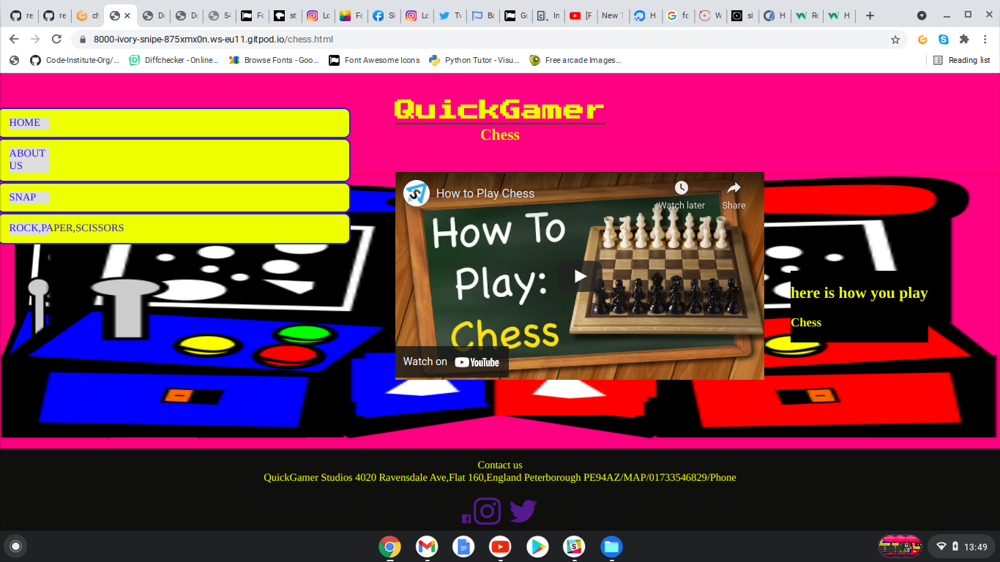

# QuickGamer
quickgamer is a page intended to have a few mini games were you will be able to navigate through the games list there you will have games such as Rock,Paper,Scissors,snap and chess. each page has a navigation bar which will alow you to go to the game of choice play area. the page is useful for people wanting to enjoy a quick gameplay in their spare time. it alows you to play and also gives toutorials for beginners to learn how to play. this is a site that hopes to demonstrate how JavaScript works behind content to allow enjoyment and interaction for the user.

## Features 
the main fetures introduced in Quick gamer are as follows 
1. the nav list- this fetuere alows you to navigate through the site giving you a choice of game
2. Rock Paper Scissors -  the main feture of the site as it has already been coded with java script to produce  a working game.
3. chess - is another future feture to be coded and added to the site.
4. snap - this is another one of are game playing options  but also a future feture right now with just the tutorial video  as the main part of that page.
5. learn how to play - a page containing bvideos on how to play games provided on the site.
6. about us - aa page providing information about the founder inspperation for the page ect.
7. the logo  written in yellow at the top of the page Quick gamer.
8. the About us page which gives information about quick gammer its founders and what it hopes to do in the future 
9.  the footer which has the ways of getting in contact with us through social media sites but also has email and telephone number

### Existing Features

- __Logo and Heading__

  - Featured at the top of the page, the Quick Gamer logo and heading is easy to see for the user. Upon viewing the page, the user will be able to see the name of the site and game  list.

- __The Game Area__
- at the moment we currently have one working gsame area for the rock paper scissors game 
  - in this game you have the three icons which are  rock, paper,scissors
  - you will have the labels for the player and the players icon and you will have the same for the bot which is the computer.
  - the tally of results wins and loses will be  in this area 
  - you will also be able to select the rules button to see how the game is played 

### nav 

### rock-paper-scissors
- the page upon click presents you with  a modul log that asks "player1 what is your name ?" depending on user input the result will now sit beside the player1 label in the game area, if the user does not input a name and hits "cancel" or "ok" the player1 label alone will represent the username.
-once on the page you have:
- nav list in the top left corner of the page.
- the logo "QuickGamer" at the top center of the page.
- the game area seated in the center contained in a black div.
- the footer at the bottom of the page containig social media contact information 

### snap

  - This page is under construction  at the moment o game for snap has been coded so i have used a video tutorial on how to play snap in the center of the page .
  - the page contains the nav list on the left .
  - the page logo  is seated at the top center of the page
  - the name of the page letting you know where you are is just under the logo 
  - the footer at the bottom of the page containig social media contact information    

### chess
 - This page is under construction  at the moment until a game for chess has been coded so i have used a video tutorial on how to play chess in the center of the page .
  - the page contains the nav list on the left .
  - the page logo  is seated at the top center of the page
  - the name of the page letting you know where you are is just under the logo 
  - the footer at the bottom of the page containig social media contact information    

### about us
- This page is under construction  at the moment.
  - the page contains the nav list on the left .
  - the page logo  is seated at the top center of the page
  - the name of the page letting you know where you are is just under the logo 
  - the footer at the bottom of the page containig social media contact information  

### home
This page is under construction  at the moment.
  - the page contains the nav list on the left .
  - the page logo  is seated at the top center of the page
  - the name of the page letting you know where you are is just under the logo 
  - the footer at the bottom of the page containig social media contact information  

###  future features to be implemented
 ##### features for snap 
 - in future i would like to have an up and runnning  simple card game where the user could play against the computer,the game area will be  positioned in the center of the page currently where the video is.we
  we will then have a link at the bottom of the game area "learn how to play" where you will have the videos of exactly how to play each game on the Quickgamer website.there will then be a rules button besides the  game area like in "rock paper scissors" that once clicked a dialog box opens up giving you intructions on how the the game works. so in future there wont be a video on this page just a game useres will be able to use the learn.html page in the nav to show them how to play the games also.

##### features for chess
 - in future i would like to have an up and runnning  simple chess game where the user could play against the computer and select his or her  choice of color for use in the game. the game area will be  positioned in the center of the page currently where the video is,
 we will then have a link at the bottom of the game area "learn how to play" where you will have the videos of exactly how to play each game on the Quickgamer website.there will then be a rules button besides the  game area like in "rock paper scissors " that once clicked a dialog box opens up giving you intructions on how the the game works. so in future there wont be a video on this page just the game, useres will be able to use the learn.html page in the nav to show them how to play the games also.

##### fetures for Rock paper scissors 
- on rock paper scissors the features to be implemented would be to have a div sorounding all the game area making it stand out more and also to have the game stop after 5 counts and  then present a winner losser or draw result based on the outcome. if the winner i would like to have a button displayed saying play again if a winner or try again if draw or loss.

##### features for about us
- the about us page like the footer will contain information about the company where you can find us, what the company is about when it was founded and also lots of other fun facts about arcades like where the name arcade originated from and where the idea came from.

##### features for home 
- the implements to b added to this page will be the layout and giving the page more content like a few images or transormations to give it more of an arcade feel

## Testing

### Validator Testing 

- HTML
    - No errors were returned when passing through the official [W3C validator](https://validator.w3.org/nu/?doc=https%3A%2F%2Fcode-institute-org.github.io%2Flove-maths%2F)
- CSS
    - No errors were found when passing through the official [(Jigsaw) validator](https://jigsaw.w3.org/css-validator/validator?uri=https%3A%2F%2Fvalidator.w3.org%2Fnu%2F%3Fdoc%3Dhttps%253A%252F%252Fcode-institute-org.github.io%252Flove-maths%252F&profile=css3svg&usermedium=all&warning=1extwarning=&lang=en)
- JavaScript
    - No errors were found when passing through the official [Jshint validator](https://jshint.com/)
      - The following metrics were returned: 
      - There are 11 functions in this file.
      - Function with the largest signature takes 2 arguments, while the median is 0.
      - Largest function has 10 statements in it, while the median is 3.
      - The most complex function has a cyclomatic complexity value of 4 while the median is 2.

### Unfixed Bugs
- nav bar- the rock paper scissors text needs to be inline in the grey shadow.but can not seem to find the reason for why it doing what its doing. 

- nav bar- the learn how to play text in the nav makes the button aea to large. would have tried to change it but i was struggling to find ewhy it was doing that anyway but would need more time,

- in the rock paper scissors game there needs to b an exit just after the 5th play so that the game area does not push off the screen

- in the footer once i added the address for the company,  the facebook icon resized  

## Deployment

- The site was deployed to GitHub pages. The steps to deploy are as follows: 
  - In the GitHub repository, navigate to the Settings tab 
  - From the source section drop-down menu, select the Main
  
  - Once the main has been selected, the page will be automatically refreshed with a detailed ribbon 
display to indicate the successful deployment. 

The live link can be found here - https://reginaldj123.github.io/quickgamer/

## Credits 
   - [Writing Your Best Code](https://learn.shayhowe.com/html-css/writing-your-best-code/)
  - [HTML & CSS Coding Best Practices](https://medium.com/@inceptiondj.info/html-css-coding-best-practice-fadb9870a00f)
  - [Google HTML/CSS Style Guide](https://google.github.io/styleguide/htmlcssguide.html#General)
- The icons in the footer were taken from [Font Awesome](https://fontawesome.com/)
- the font used to create the page logo[google fonts](https://fonts.google.com/)
- the video helped in me creating the rock paper scissors game[youtube](https://www.youtube.com/watch?v=1yS-JV4fWqY)
- the video on the chess page taken from[youtube](https://www.youtube.com/watch?v=fKxG8KjH1Qg&t=9s)
- the video on the snap page taken from[youtube]("https://www.youtube.com/embed/2dsHuU10udY")
- the video on the snap page taken from[youtube](https://www.youtube.com/embed/9cFOr2T2eb8)
- how to code rock paper scissors game[youtube](https://www.youtube.com/watch?v=1yS-JV4fWqY)